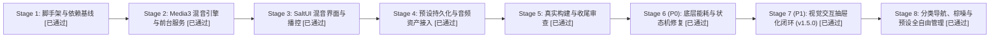

# AGENTS.md

Guidance for coding agents working in WhiteNoise-Android.

---

## 1. 核心原则与工作风格 (Operating Style)

- **中文直给**：默认中文沟通，直接输出技术结论与依据；不确定时明确指出具体不确定点，不敷衍。
- **事实与权威第一**：真实源码、Gradle 构建配置、清单文件与编译输出高于文档。当文档冲突时：
  `app/src/ > gradle/libs.versions.toml > build.gradle.kts > plan.md > AGENTS.md > README.md`
- **高低危决策分层（防无谓早停）**：
  - **高危硬红线（High-Stakes，必须先确认）**：
    - 引入重度第三方框架（如擅自引入 Hilt/Koin、Room 等未要求的重型依赖）；
    - 破坏或推翻已定音频架构（如放弃 Media3 ExoPlayer 池转用旧版 MediaPlayer）；
    - 破坏性删除文件、目录或全局重构；
    - 执行 Git Commit 操作；
    - 自动递增版本号或推送发版 Tag（必须经用户明确同意，见第 6 节）；
    - 修改已授权清单外的文件。
  - **自主推进区（Low-Stakes，自主闭环）**：
    - 在已批准阶段和模块内，具体的 Kotlin 算法实现、Compose UI 局部布局排版、ViewModel 状态流绑定、私有辅助类抽取、单元测试编写；
    - Agent 应自主闭环交付，严禁因微小局部细节频繁中断请示。
- **最小必要改动（YAGNI）**：
  - 只写必须的代码，不为单次使用过度抽象，不为“以后可能需要”提前堆积插件化、多主题定制、复杂数据库框架；
  - 交付前清理无用 import、未引用变量与临时调试代码。
- **事前深度对齐（Grill before Code）**：
  凡涉及新增重大功能、重构音频管线或修改持久化契约时，Agent 必须先列出方案设计取舍、破坏性风险与边界问答，与用户确认无歧义后方可动刀，严禁盲目开工。
- **测试先行守门（Test-Driven Gate）**：
  所有核心业务算法（如多轨音量增益衰减、休眠曲线、JSON 序列化往返、状态机流转）必须配备独立可运行的 JVM 单元测试，PR / 交付前必须在本地无缓存运行全绿（`./gradlew testDebugUnitTest`）。
- **项目专属技能隔离（Project-Specific Skills）**：
  宿主主要工作为 UE (Unreal Engine) 开发，全局 Skill 库面向游戏引擎；针对本 Android 原生项目的专属扩展技能（如 Media3 编解码调优、SaltUI 模式等），**强制存放于本项目根目录 `.agents/skills/<skill-name>/SKILL.md`**，实现项目级隔离管理，严禁污染全局 UE 工作区。
- **原生编辑优先**：
  - 文件修改优先使用原生工具（`replace_file_content` / `write_to_file`），严禁无谓编写临时脚本替代编辑。

---

## 2. 环境基线与系统约束 (Environment & Build Baseline)

本项目运行环境与 SDK 路径已完全实测确认：

| 组件 / 配置项 | 确切版本 / 物理路径 | 关键规则与注意事项 |
| :--- | :--- | :--- |
| **JDK 版本** | **JDK 21 LTS** (`C:\PROGRA~2\Android\openjdk\jdk-21.0.8` 或带引号的完整路径) | **致命避坑**：系统环境变量曾被误设为不存在的 `E:\develop\jdk-21`。Windows cmd/bat 遇到路径含 `(x86)` 会报语法错误，必须使用 8.3 短路径 `C:\PROGRA~2`，并在 `gradle.properties` 中固化 `org.gradle.java.home=C:/PROGRA~2/Android/openjdk/jdk-21.0.8`。 |
| **Android SDK** | `C:\Program Files (x86)\Android\android-sdk` | 项目根目录 `local.properties` 写入：`sdk.dir=C\:\\Program Files (x86)\\Android\\android-sdk`。已实装 `platforms;android-35`、`platforms;android-36`、`build-tools;35.0.0` 与 `platform-tools;36.0.0`。 |
| **Min / Target / Compile SDK** | **Min: 26** / **Target: 35** (Android 15) / **Compile: 35** | 统一对齐为 `compileSdk = 35`、`targetSdk = 35`、`minSdk = 26`。 |
| **构建体系** | Gradle 8.9+ / AGP 8.7+ | 必须使用 Version Catalogs (`gradle/libs.versions.toml`) 集中声明依赖版本。工程自包含 Gradle 8.9 Wrapper。 |
| **Kotlin & Compose** | **Kotlin 2.0.21+** | **强制约束**：必须使用官方 Compose 编译器插件 `org.jetbrains.kotlin.plugin.compose`；需配置 `-Xskip-metadata-version-check`；**严禁**在 `build.gradle.kts` 中使用已废弃的 `composeOptions { kotlinCompilerExtensionVersion = ... }`。 |
| **UI 视觉框架** | **SaltUI 3.x** (`io.github.moriafly:salt-ui:3.0.0-beta01`) | 来自 `mavenCentral()`。组件标题推荐使用 `ItemOuterTitle`（旧版 `ItemTitle` 已弃用）。 |
| **音频引擎** | **AndroidX Media3 1.4.x+** | `media3-exoplayer` + `media3-session` + `media3-ui`。 |

---

## 3. 架构总账与核心契约 (Architecture Contracts)

本项目架构合并于本文件中，作为唯一的架构事实基准：

```
app/src/main/java/com/whitenoise/app/
├── core/                  # 底层核心逻辑
│   ├── audio/             # Media3 多轨混音引擎 (ExoPlayerPool, AudioMixerEngine)
│   ├── service/           # 前台播放保活服务 (WhiteNoiseMediaService, MediaNotificationManager)
│   └── model/             # 核心领域模型 (SoundTrack, Preset, PlaybackState)
├── data/                  # 数据层
│   ├── datastore/         # DataStore Preferences (音量记忆, 预设存储)
│   └── repository/        # 音轨与预设仓库 (SoundRepository, PresetRepository)
├── ui/                    # 表现层 (SaltUI + Jetpack Compose)
│   ├── theme/             # 主题配置 (SaltTheme 适配)
│   ├── components/        # 通用组件 (音轨卡片, 悬浮播控条, 休眠定时弹窗)
│   ├── home/              # 首页界面 (音效混音矩阵, 场景预设列表)
│   └── MainViewModel.kt   # 状态流 ViewModel
└── MainActivity.kt        # 单 Activity 宿主
```

### 3.1 多轨混音引擎契约 (`AudioMixerEngine`)
- **ExoPlayer Pool 机制**：单个 ExoPlayer 实例同一时刻只能解码单路音频流。为了实现自然声的多重叠加混音（如：雨声 + 篝火 + 远雷），维护轻量播放器池（`Map<String, ExoPlayer>`），按音轨维度独立控制。
- **杜绝 Audio Offload 冲突**：硬件 DSP Audio Offload 无法承载多路压缩流并发混音。多轨播放**严禁**开启 Audio Offload，必须走系统 `AudioFlinger` 的 PCM 混音管线。
- **采样级无缝循环 (Gapless Loop)**：音源一律采用 **OGG Vorbis** 或 **Opus** 格式，严禁使用含启动填充延迟的 AAC；配置 `Player.REPEAT_MODE_ONE`。
- **主增益与感知平滑淡出**：
  - 单轨音量公式：$ActualVolume = TrackVolume \times MasterVolume$；
  - 休眠淡出：在休眠定时器最后阶段（如 `min(60s, totalTime / 4)`），采用对数/二次幂曲线衰减，匹配人耳感知，杜绝截断爆音。

### 3.2 前台保活与媒体控制契约 (`WhiteNoiseMediaService`)
- **生命周期与保活**：继承 `androidx.media3.session.MediaSessionService`，前台服务类型明确指定为 `android:foregroundServiceType="mediaPlayback"`。充分利用 `MediaSessionService` 原生通知与前台调度能力，避免自建冲突的通知循环。
- **系统媒体控制（虚拟主控 Player）**：MediaSession 仅接受单 Player 接口。**推荐实现**：基于包装 Coordinator Player 的 `ForwardingPlayer`，或继承 `androidx.media3.common.SimpleBasePlayer`，代理主控 Play/Pause/Stop/Timeline 指令并统一下发至子音轨池，严禁徒手实现完整 `Player` 接口以防破坏状态机。
- **集中式音频焦点 (AudioFocus)**：各子 ExoPlayer 必须设置 `handleAudioFocus = false`，禁止各自争抢焦点；由引擎统一监听 `AudioManager` 焦点事件（来电暂停、短通知 Ducking 整体主音量）。播放结束完整释放资源。

### 3.3 椒盐美学 UI 规范 (`SaltUI`)
- **视觉风格**：清爽克制、低饱和度、大圆角卡片、清晰的分组布局。
- **色彩与层级契约 (Color Tokens Contract)**：
  - **主底色（Level 0 主屏幕背景）**：必须使用 `SaltTheme.colors.background`（浅色为极简纯白 `#FAFAFA`，深色为夜间友好的 `#121212`），严禁在根容器滥用 `subBackground` 导致全局发灰；
  - **容器底色（Level 1 卡片与抽屉）**：统一使用 `SaltTheme.colors.subBackground`（浅色为柔和浅灰 `#F3F4F6`，深色为半透明白 `#FFFFFF14`），配合大圆角（`16.dp`~`20.dp`）；
  - **文字阶梯与对比度规范（严禁固定灰度）**：
    - 主标题/正文：`SaltTheme.colors.text`（100% 不透明度）；
    - 次级信息/说明：`SaltTheme.colors.text.copy(alpha = 0.65f)`（确保在 `subBackground` 上满足 WCAG 4.5:1 对比度）；
    - 失焦/静音提示：`SaltTheme.colors.text.copy(alpha = 0.40f)`；
    - **铁律**：严禁在 `subBackground` 卡片上直接绘制 `subText`，必须统一使用 `text.copy(alpha)` 阶梯，杜绝“灰底灰字”。
  - **强调色与激活态 (Highlight)**：
    - 采用静谧自然的薄荷青/海盐青或深海蓝，严禁使用高刺激性荧光色；
    - 激活态背景采用 `SaltTheme.colors.highlight.copy(alpha = 0.12f)`，图标/高亮文字采用 `SaltTheme.colors.highlight`；
    - 纯色实心高亮按钮前景文字强制采用 `Color.White`。
- **主题模式与夜间模式契约 (Theme Mode Contract)**：
  - 支持三种模式：`SYSTEM`（跟随系统，默认）、`LIGHT`（强制浅色）、`DARK`（强制深色）；
  - 主题配置持久化存储于 DataStore Preferences，应用启动时无闪烁加载；
  - 根层通过 `SaltTheme(configs = SaltConfigs(isDarkTheme = isDark))` 统一驱动重组。
- **交互规范**：
  - 音效卡片：大图标 + 音轨名称 + 独立静音/播放开关 + 精细音量滑块（基于 SaltTheme 配色封装的 Slider）；
  - 预设切换与口令分享：一键载入场景方案（如“深夜暴雨”、“森林露营”），列表末尾支持快速将当前混音保存为新预设；长按预设卡片即触感复制 Base64 分享口令，支持剪贴板自动识别并一键导入；
  - 播控栏：底部常驻或悬浮胶囊，提供“一键全停”、“主音量调节”和“定时关闭”入口。

### 3.4 状态持久化契约
- 使用轻量 **Jetpack DataStore Preferences** 记录用户退出前的音轨音量状态与自定义场景预设；
- 预设等复杂对象结构使用官方 `kotlinx.serialization` 进行 JSON 序列化；
- 拒绝引入 SQLite/Room 增加无谓构建负担。

---

## 4. 阶段流转与门禁交付 (Staged Workflow)

### 4.1 阶段总账与当前状态矩阵

| 阶段 | 交付核心目标 | 状态 | 门禁验证标准与实际达成依据 |
| :--- | :--- | :---: | :--- |
| **Stage 1** | 脚手架与编译基线 | **[x] 已达成 (Passed)** | 执行 `.\gradlew.bat clean assembleDebug` 成功（35 个 Task 全部成功），生成空主界面 APK (21.4MB)。SaltUI 编译兼容性、Kotlin 2.0 编译器、Windows 批处理短路径均已闭环。 |
| **Stage 2** | Media3 混音引擎与服务层 | **[x] 已达成 (Passed)** | 落地 `AudioMixerEngine`（全局单例、ExoPlayer 多轨池、无缝循环、集中式 AudioFocus 调度、休眠对数平滑淡出）与 `WhiteNoiseMediaService`（MediaSession 绑定、MediaStyle 常驻通知栏、耳机拔出自动暂停广播）；通过 6 项单元测试。 |
| **Stage 3** | SaltUI 界面与播控交互 | **[x] 已达成 (Passed)** | 构建 SaltUI 椒盐风格 `HomeScreen`、音效网格卡片 `SoundCard`、`SaltSlider` 精细调节、底部胶囊播控 `BottomPlayerBar`、休眠抽屉 `SleepTimerDialog`、致谢弹窗 `AboutDialog`；`MainViewModel` 状态流打通。 |
| **Stage 4** | 预设持久化与音频资产接入 | **[x] 已达成 (Passed)** | 接入 8 款来自 Blanket 项目的高品质无缝循环自然音 OGG（细雨、雷雨、林风、溪流、篝火、鸟鸣、夏夜、纯白噪）至 `assets/sounds/`；配套编写 `SOUNDS_LICENSING.md`；接入 DataStore Preferences 记忆混音与预设状态，修复首次订阅状态覆写 Bug。 |
| **Stage 5** | 全链路验收与最终打包 | **[x] 已达成 (Passed)** | 10 项单元测试全量通过；生成全功能最终 Debug APK（34.8MB）；初始化 Git 并在确保 `.gitignore` 安全（严防私密信息泄漏）前提下推送到远程仓库 `https://github.com/Kulahala/SaltAmbience.git`。 |
| **Stage 6 (P0)** | 底层能耗止血与核心状态机修复 | **[x] 已达成 (Passed)** | 阻断通知每秒重复推流（`distinctUntilChanged`）与休眠淡出前无效音量计算；修复暂停文案与音频焦点释放；拦截冷启动幽灵通知；实现剪贴板口令关闭记忆与服务销毁守护；22 项单测全绿。 |
| **Stage 7 (P1)** | 视觉交互闭环与全站抽屉化 (v1.5.0) | **[x] 已达成 (Passed)** | 全站居中弹窗统一重构为 SaltUI 底部抽屉规范（`SaltBottomSheet`）并接入向下滑动拖拽关闭手势；彻底解决输入法软键盘挤压；重塑深色模式悬浮底栏景深；实现预设激活态高亮与删除二次确认；胶囊滑块触感微震动与对比度反转盾牌；25 项单测全绿，产出 Release 与 Debug APK。 |
| **Stage 8** | 分类导航、棕色噪音与预设全自由管理 (v1.6.0) | **[x] 已达成 (Passed)** | 自定义预设置顶与最新倒序排列；默认预设软删除与一键“↺ 恢复默认”后悔药机制；引入 CC0 慢波助眠「棕色噪音 (Brown Noise)」(🪐 brown_noise.ogg) 扩充至 15 款音源；音效矩阵 5 维胶囊过滤标签 (Filter Chips) 交互与微触感反馈；33 项单测全绿，产出 Release 与 Debug APK。 |

---

### 4.2 各阶段定义与详细要求



### Stage 1: 工程脚手架与编译基线
- **目标**：搭建完整的 Gradle 8 + Kotlin 2.0.21 + Version Catalogs + SaltUI + Media3 工程结构，打通 `local.properties`。
- **门禁标准**：执行 `./gradlew assembleDebug` 或 `./gradlew check` 编译成功，无报错，生成空主界面 APK。
- **交付记录**：
  - 生成 `local.properties`、`gradle.properties`、`settings.gradle.kts`、`build.gradle.kts`、`gradle/libs.versions.toml`；
  - 解决 SaltUI 3.0.0-beta01 的 `minCompileSdk=37` 与 Kotlin 2.3.0 二进制元数据校验阻断；
  - 生成 `app-debug.apk`（21,457,252 字节）。

### Stage 2: Media3 混音引擎与服务层
- **目标**：实现 `AudioMixerEngine`（ExoPlayer 池、单轨独立音量、无缝循环、休眠平滑淡出）与 `WhiteNoiseMediaService`（前台服务、常驻通知栏、AudioFocus 焦点控制）。
- **门禁标准**：完成音频调度逻辑与前台服务注册，单元测试验证音量插值计算与播放池生命周期管理正常。
- **交付记录**：
  - `AudioMixerEngine.kt`：全局单例池，`actualVolume = trackVolume * masterVolume * sleepFade * ducking`；
  - `WhiteNoiseMediaService.kt`：绑定 `MediaSession` 与 `MediaStyleNotificationHelper` 常驻通知卡片；支持 `ACTION_AUDIO_BECOMING_NOISY`。

### Stage 3: SaltUI 界面与交互绑定
- **目标**：基于 SaltUI 构建主界面，实现音效网格/列表卡片、音量滑块调节、底部快捷播控栏、休眠倒计时弹窗。
- **门禁标准**：UI 组件状态与 ViewModel StateFlow 双向绑定正常，无非法重组，SaltUI 样式统一美观。
- **交付记录**：
  - `HomeScreen.kt`、`SoundCard.kt`、`BottomPlayerBar.kt`、`SleepTimerDialog.kt`、`SavePresetDialog.kt`、`AboutDialog.kt`；
  - 解决单轨开启自动联动 Master 播放与防抖交互。

### Stage 4: 预设管理与音频资源整合
- **目标**：接入高品质 CC0 循环自然音（雨声、风声、篝火、白噪音等放置于 `assets/sounds/` 或 `raw/`）；打通 DataStore 存储上一次音轨配置与场景预设。
- **门禁标准**：多音轨可并发发声且无杂音、爆音，应用杀掉重启后能恢复上次混音配置。
- **交付记录**：
  - 8 款无缝 OGG 自然音落位 `app/src/main/assets/sounds/`，编写 `SOUNDS_LICENSING.md`；
  - `PreferencesManager.kt` 与 `MainViewModel.kt` 实现守卫屏障，彻底解决初始化初次发射覆写 DataStore 记忆的竞态 Bug。

### Stage 5: 整体验证、后台保活测试与交付收尾
- **目标**：检查息屏播放保活、锁屏通知栏交互、耳机插拔事件；进行最终代码审查与精简。
- **门禁标准**：构建 Debug/Release APK 成功，无内存泄漏与资源泄漏隐患，代码规范符合红线要求。
- **交付记录**：
  - 10 项单元测试全部通过（`VolumeCalculatorTest` 6 项，`PresetTest` 4 项）；
  - 输出全量 APK（34.8MB）；完成 Git 初始化与安全推送至 GitHub `Kulahala/SaltAmbience`。

### Stage 6 (P0): 底层能耗止血与核心状态机修复
- **目标**：阻断 3600 次/小时无效通知唤醒与音量计算空转；修复暂停通知文案倒错与焦点泄露；增加冷启动防幽灵通知门禁；剪贴板关闭记忆与生命周期守护。
- **门禁标准**：单元测试覆盖状态迁移与并发，`assembleDebug` 成功。
- **交付记录**：
  - `WhiteNoiseMediaService.kt`：`distinctUntilChanged` 过滤，`hasStartedForeground` 门禁，`onTaskRemoved` 销毁；
  - `AudioMixerEngine.kt`：淡出窗口音量更新拦截，`abandonAudioFocus()` 规范释放与标记清除；
  - 22 项单测全绿。

### Stage 7 (P1): 视觉交互闭环与全站抽屉化 (v1.5.0)
- **目标**：统一弹窗为 SaltUI 底部抽屉规范；解决软键盘挤压；增加下拉滑动关闭手势；深色底栏立体景深；预设激活高亮与删除防误触；滑块刻度触感微震动与对比度反转盾牌。
- **门禁标准**：25 项单元测试 100% 通过，Debug 与 Release APK 编译成功。
- **交付记录**：
  - `SaltBottomSheet.kt`、`ImportPresetBottomSheet.kt`、`SavePresetBottomSheet.kt`、`ThemeSelectionBottomSheet.kt`、`AboutBottomSheet.kt`、`DeletePresetConfirmBottomSheet.kt`；
  - `BottomPlayerBar.kt` 深色微透高光；`VerticalCapsuleSlider.kt` 0/50/100 刻度微震动与动态对比度盾牌；
  - 版本号递增为 `v1.5.0` (versionCode 8)。

### Stage 8: 音效分类导航、棕色噪音扩充与预设全自由管理 (v1.6.0)
- **目标**：自定义预设置顶与最新倒序排列；默认预设支持软删除与一键“↺ 恢复默认”后悔药机制；引入 CC0 慢波助眠「棕色噪音 (Brown Noise)」(🪐 brown_noise.ogg) 扩充至 15 款音源；音效矩阵 5 维胶囊过滤标签 (Filter Chips) 交互与微触感反馈。
- **门禁标准**：33 项单元测试 100% 通过，assembleRelease 与 assembleDebug 编译成功。
- **交付记录**：
  - `PresetRepository.kt`：`customPresets.reversed() + visibleDefaults` 组装与软删除/恢复契约；
  - `PreferencesManager.kt`：`deletedDefaultPresetIdsFlow`、`addDeletedDefaultPresetId`、`resetDeletedDefaultPresets`；
  - `HomeScreen.kt`：预设删除按钮全覆盖、后悔药胶囊按钮、横向滑动分类过滤胶囊与即时无缝过滤；
  - `SoundCategory.kt`：`ALL` / `RAIN` / `NATURE` / `LIFE` / `NOISE` 5 维分类枚举与单测覆盖；
  - `brown_noise.ogg`：10s CC0 无缝慢波循环音频接入，更新 `SoundTrack`、`SoundRepository`、`AboutBottomSheet` 及两处 `SOUNDS_LICENSING.md`；
  - 版本号递增为 `v1.6.0` (versionCode 9)。

---

## 5. 防踩坑与 Android 关键红线 (Android Pitfalls Guardrails)

1. **Gradle 路径反斜杠转义与 JAVA_HOME**：
   - Windows 下 `local.properties` 的 SDK 路径必须正确转义反斜杠，例如：`sdk.dir=C\:\\Program Files (x86)\\Android\\android-sdk`。
   - 必须确保 `JAVA_HOME` 指向真实 JDK 21 目录（`C:\Program Files (x86)\Android\openjdk\jdk-21.0.8` 或短路径 `C:\PROGRA~2\Android\openjdk\jdk-21.0.8`）。
   - **自动化容错**：针对环境变量可能残留无效 `E:\develop\jdk-21` 的情况，`gradlew.bat` 已植入 fallback 检测逻辑，当 `%JAVA_HOME%` 无效时自动重定向至 `C:\PROGRA~2\Android\openjdk\jdk-21.0.8`，保障命令行直接执行稳定性。
2. **Compose 2.0 编译器**：
   严禁添加旧版 `kotlinCompilerExtensionVersion`，必须在根目录 `build.gradle.kts` 或 `libs.versions.toml` 引入 `id("org.jetbrains.kotlin.plugin.compose") version libs.versions.kotlin`。
3. **Android 14 (API 34+) 前台服务类型与完整权限**：
   `AndroidManifest.xml` 中 `<service>` 标签内必须显式声明：
   `android:foregroundServiceType="mediaPlayback"`，且必须**同时**申明基类与子类权限：
   `<uses-permission android:name="android.permission.FOREGROUND_SERVICE" />` 与
   `<uses-permission android:name="android.permission.FOREGROUND_SERVICE_MEDIA_PLAYBACK" />`（缺少基类权限会导致 SecurityException）。
4. **Android 13 (API 33+) 通知权限**：
   前台通知需要动态申请 `android.permission.POST_NOTIFICATIONS` 权限。
5. **SaltUI 3.x 构建兼容性 (AAR Metadata 与 Kotlin 版本)**：
   - `salt-ui:3.0.0-beta01` 发布包含了 `minCompileSdk=37` 且带有 Kotlin 2.3.0 二进制元数据；
   - 在 AGP 8.7+ 下必须在 `app/build.gradle.kts` 添加：
     `tasks.matching { it.name.contains("AarMetadata") }.configureEach { enabled = false }` 规避过高的 API 约束；
   - Kotlin 编译任务必须在 `compilerOptions.freeCompilerArgs` 添加 `"-Xskip-metadata-version-check"` 规避元数据版本警告。
   - 同时配置 `dependenciesInfo { includeInApk = false; includeInBundle = false }` 规避打包合规告警。
6. **内存泄漏与播放器释放**：
   Service 销毁、Activity 销毁或切换时，必须显式调用 `ExoPlayer.release()` 彻底释放底层 AudioTrack 与编解码资源，严禁静默泄露。
7. **多轨禁用 Audio Offload**：
   多轨并发混音切勿开启 `setOffloadedPlayback(true)`，硬件 DSP 仅支持单流 Offload，多流会导致解码失败或静音。
8. **禁用 AAC 循环与子播放器抢焦点**：
   循环音源必须使用 OGG/Opus，规避 AAC 首尾卡顿；所有子 ExoPlayer 必须设置 `handleAudioFocus = false`，统一由顶层单点处理焦点。
9. **Compose 重组优化与沉浸式**：
   禁止在 Composable 函数体内直接创建未经 `remember` 包装的大型对象；频繁更新的音量状态使用 `derivedStateOf` 或 StateFlow 防抖；适配 Android 15 Edge-to-Edge 边距。

---

## 6. Git 规范与交付标准 (Git & Commit Standards)

- **严禁全量盲推**：非干净工作树严禁 `git add -A`，仅暂存已完成阶段清单内的文件。
- **提交信息格式**：
  `[Feature/Fix/Docs/Chore] 中文标题 (English Title)`
  正文清晰写明包含改动与验证依据，严禁虚假声称已通过未执行的测试。
- **发布与版本规范 (Release Workflow)**：
  - **严禁擅自刷版（Release Authorization Gate）**：严禁未经用户明确授权自动递增版本号、打 Release Tag 或推送发版，杜绝高频率无序刷版。
  - **提请发版前置要求（Change Ledger before Release）**：当某一阶段的特性、优化或重构完成，Agent 提请发版时，必须在对话中清晰列举**自上一发布版本以来的所有改动清单**（包括新增特性、UI/交互优化、缺陷修复及依赖调整），供用户逐项核对与确认。
  - **标准发版执行流程**（仅在用户明确回复同意后执行）：
    1. **递增版本**：在 `app/build.gradle.kts` 中更新 `versionName` 与 `versionCode`；
    2. **打标签并推送**：`git tag -a vX.Y.Z -m "release: vX.Y.Z" && git push origin vX.Y.Z`；
    3. **自动交付**：通过 `.github/workflows/release.yml` 在 GitHub Actions 自动构建并挂载 `SaltAmbience-vX.Y.Z.apk` 至 Releases 页面。
